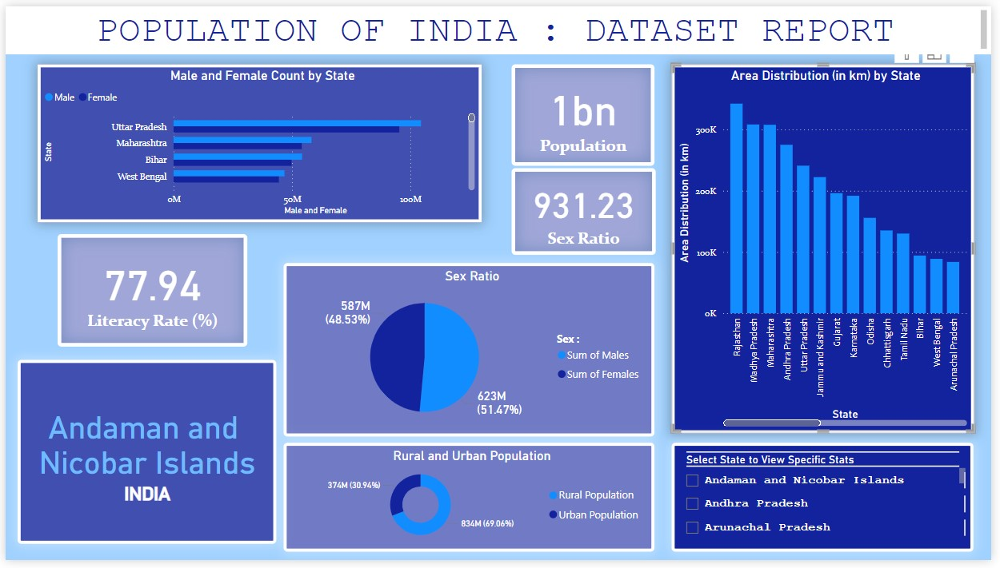
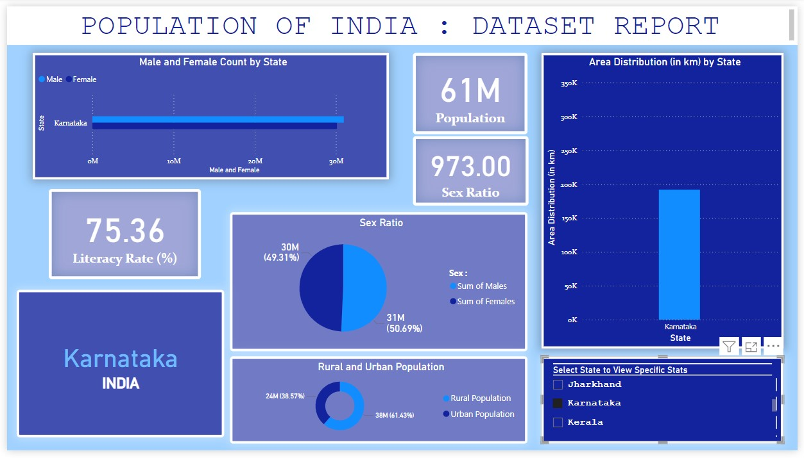
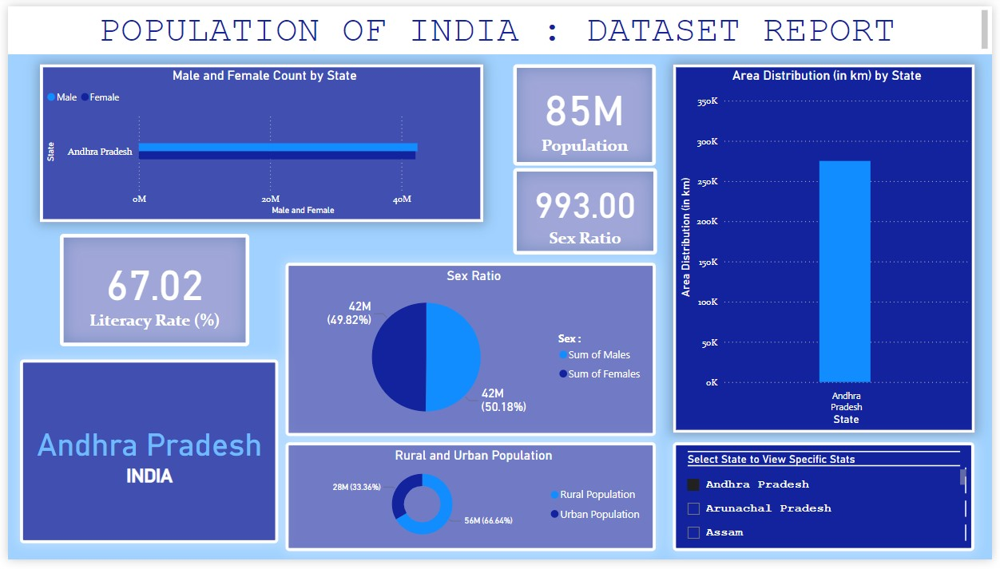
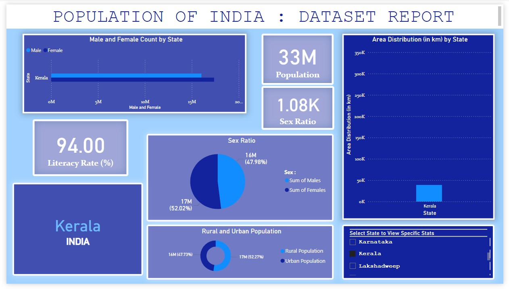

# POPULATION DISTRIBUTION OF INDIA : DATASET REPORT USING POWER BI
---
## POWERBI:
```
A Microsoft Data Visualization Tool which helps to Visualize few to Thousands of records.
Using which I have tried to analyse the [Dataset](population.csv) which has 35 records keeping fields such as State, Capital, Literacy Rates, Sex Ratio ...
The 35 records are specific data based on States and Union Territories Present in **INDIA - Our Motherland** giving us data based on the fields present.
Using the fields, The data present is being filtered to Visuals such as Graphs, charts and a report which make the dataset more easily understandable.
```
## FIELDS present in the DATASET / DATASET DESCRIPTION:
|Rank | State	| Capital	| Population | % of Total Population |	Males |	Females	| Sex Ratio	| Literacy Rate (%) |	Rural Population |	Urban Population	Area (km*km) | Density (km * km) | Decadal Growth (%) |

## Visualizations used in the Report:
1. Clustered Bar Chart (Male and Female Count by State)
2. Clustered Column Chart (Area Distribution(in km) according to state)
3. Pie Chart (Sex Ratio)
4. Donut Chart (Rural and Urban Population)
5. Cards (Population, Sex Ratio, Literacy Rate)
6. Slicer (State selection to view data specific to each state)

## Features (can be made specifc to State-wise or Union-Territory wise by utilisizing the slicer which is already present) :
- Helps determine the literacy rate.
- Helps determine the Population.
- Helps determine the Sex-Ratio.
- Helps determine the Rural and Urban Population.
- Helps determine the Male and Female Count.
- Interactive Visuals which enable dynamic filtering and exploration of the data.

## SnapShots :
Home Report:


Karnataka:


Andhra Pradesh:


Kerala:


## How to Use
1. **Download the Files**:
   - Clone the repository or download it as a ZIP file.
   - Extract the contents to your local machine.

2. **Open in Power BI**:
   - Install [Power BI Desktop](https://powerbi.microsoft.com/desktop/), if not already installed.
   - Open `Population_Distribution.pbix` in Power BI Desktop.

3. **Explore the Report**:
   - Use the interactive visuals to analyze the data.
   - Apply filters to view specific segments of the population.

## License
This project is licensed under the [MIT License](LICENSE).

## Contributing
If you wish to contribute:
1. Fork this repository.
2. Make your changes and submit a pull request.

Enjoy exploring the data!
